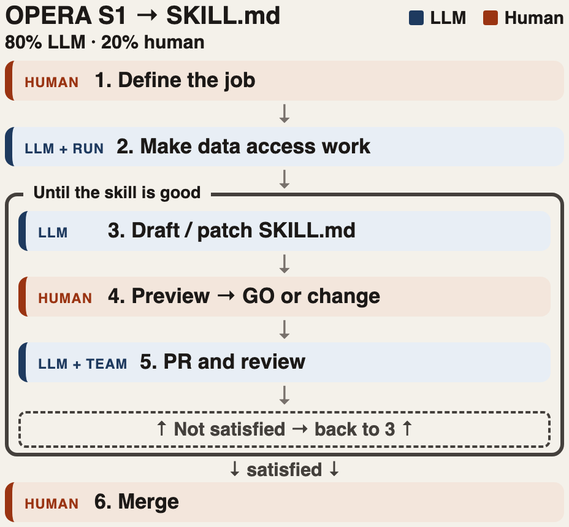

# Andrew Joros (@ajoros)

Project co-lead. Davis Fire / Winters–Davis Creek snow-melt AOI, plus how we turn a working NASA data-access path into a shared agent skill.

## What I’ve done

- **Pinned the AOI.** Winters Creek + Davis Creek basins (8.49 km²), not the old padded Washoe box. Shapefiles in [aoi/gis/](aoi/gis/). NISAR launched after the 2024 fire, so pre/during/post burn is Sentinel-1; NISAR is post-fire only.
- **Got OPERA RTC-S1 onto disk.** Catalog, size-check, then VV COGs only (Feb–Aug 2017–2026, Davis + MCS). ~11 GiB stays **local** under `data/opera-rtc-s1-vv/` (gitignored). ASF download needs `~/.netrc`, not a Bearer token.
- **Wrote the data-access skill** with an 80% LLM / 20% human loop: prove access → draft `SKILL.md` → preview → PR → team review → patch until it is good enough to merge. Team feedback (e.g. put Earthdata auth in the skill body, not the YAML description) goes back into the same loop.

- **Onset baseline.** Polygon-mean snowmelt runoff-onset DOWY from Gagliano et al. (Zenodo Zarr): [mean_dowy.py](mean_dowy.py). Local melt-season VV stacks around onset are in progress, not in this repo.

## Setup (local)

- Env: pixi (`pixi install` / `pixi run`). Do not bring back `environment.yml`.
- Earthdata: CMR search can use `EARTHDATA_TOKEN`. ASF datapool download needs `~/.netrc`. Unset the token before download or ASF returns 401. Never put tokens in git.

## Davis Fire (short)

- Burn: 2024-09-07 to 2024-09-25. Envelope W,S,E,N: `-119.88496, 39.29819, -119.82518, 39.32630`
- Notes: [nisar-coverage-davis.md](nisar-coverage-davis.md), [sentinel1-coverage-davis.md](sentinel1-coverage-davis.md)
- Scripts: [opera_vv_size_check.py](opera_vv_size_check.py), [download_opera_rtc_vv.py](download_opera_rtc_vv.py)
- Prefer NISAR **provisional** over beta; do not mix them. GOFF / RIFG / RUNW / ROFF: none on this box.

## Still to do

- Status-quo agent prompt on Davis Fire (write fail cases)
