# VirtualiZarr for NISAR access

Scratch space for the project idea in the top-level [`README.md`](../../README.md):

> Explore a [VirtualiZarr](https://virtualizarr.readthedocs.io/en/stable/) approach to working with NISAR data.

It grew from a feasibility test over one mountain into a catalogued, validated collection of
virtual NISAR GCOV cubes covering **western North America** — 1,008 cubes, 6,359 granule-bands,
built in 35 minutes, 1.7 GB of index over 19.5 TB of imagery. This README is the write-up: what
virtualization is, what it costs, whether the result is science-grade, and how to use what was built.

## Abstract

**What.** A NISAR granule is a 6.9 GB HDF5 file whose rasters are already stored as thousands of
independently compressed 512 × 512 blocks. *Virtualization* reads the location of every block —
byte offset and length — exactly once and writes that list down as a Zarr chunk manifest. Nothing
is copied or converted: the pixels stay in ASF's bucket, and the manifest (a few hundred KB per
granule) makes a stack of granules look like a single Zarr array you can slice by time, y and x.

**Why here.** Every time anyone opens a NISAR file, h5py walks the file's internal B-tree over the
network to find those same blocks — and pays again next session, for every granule, for every
user. For a time series that cost dominates: the science asks for a 1 km field across 24 dates, but
finding those chunks moves ~1 GB and takes ~20 s per analysis. The archive is also too large to
duplicate — 80 TB/day, ~7 PB for a million granules — so a converted copy is not on the table. A
manifest is: it is ~48,000× smaller than the data it indexes, cheap to store in Icechunk, and can
be shared so only the first person ever pays the build.

**What we found.** Over Mount Rainier, one track, 24 acquisitions: building the index takes
~0.4–1 s per granule; reopening the finished cube takes 0.1 s versus 16 s to open a single granule
the usual way. The same median-backscatter analysis runs **in 2–3 s instead of 20–36 s in-region (9–13×),
moving 63 MB instead of 1.1 GB (18× less)**, and returns byte-identical pixels. It still works off
AWS over HTTPS (4–9× faster than granule-at-a-time), and appending a new acquisition takes about a
second. The signal is real: L-band HH over the Paradise SNOTEL field anti-correlates with measured
snow-water-equivalent (r = −0.68), ordered against Sentinel-1 the way wavelength predicts. The
catch is that a cube can only span granules on one identical output grid — so the unit of work is
one track-frame, and scaling up is a cataloguing problem, not a data problem.

## Plain-language summary

If you have worked with cloud-optimized GeoTIFFs, you already know the trick that makes them fast:
the file carries a small table of contents up front, so a reader can jump straight to the tiles it
needs instead of downloading the whole image. NISAR's radar images are not stored that way. Each
scene is a 7 GB HDF5 file, and its table of contents is scattered through the file in a way a reader
has to reassemble, over the network, every single time the file is opened. Open 24 scenes to build a
time series and you do that 24 times; come back tomorrow and you do it all again.

"Virtualization" is simply doing that reassembly once and saving the answer. We open each scene,
note where every 512 × 512-pixel tile lives (which file, which byte, how long), and write those
notes into a small index. The index is what people then open. It is a few hundred kilobytes per
scene — tens of thousands of times smaller than the imagery — but to software like `xarray` it looks
like one tidy stack of images with a time axis, ready to slice by place and date. The pixels are
never copied; when you ask for a window over your study site, the index tells the reader exactly
which byte ranges to fetch from NASA's original files, and nothing else.

Why not just convert NISAR to a cloud-friendly format? Because it produces 80 TB a day, and keeping a
second copy current would cost more than most groups can carry. An index, by contrast, is cheap
enough to keep on S3 and share, so the first person to build it is the last one who pays.

Over Mount Rainier we measured the difference on a real snow question. Finding the scenes is not
the problem: both `earthaccess` (NASA's CMR) and `asf_search` (ASF's own index) return the list in
under a second — though they disagree by one scene, so a pipeline should check both. Opening them
is the problem. The same 24-date backscatter time series took under 3 seconds from the index versus
20–36 seconds opening the files directly with `s3fs`, and about 30 seconds with the idiomatic
`earthaccess.open()` — moving 18 to 30 times less data over the wire, with pixel-for-pixel identical
results. (Tuning `earthaccess.open()`'s cache to NISAR's chunk size gets it to 15 seconds; the
rest of the gap is the file-opening cost that only an index removes.) It also works from a laptop
outside AWS. The one constraint to know about: scenes can only be stacked if they sit on the same
map grid, so a continent's worth of NISAR becomes a *collection* of stacks plus a catalog to find
the right one — the familiar STAC pattern, applied to indexes instead of files.

## What is in this folder

| | | |
|---|---|---|
| 1 | [`1_test_virtualizarr.ipynb`](1_test_virtualizarr.ipynb) | **Does it work?** Feasibility against real granules, failures kept in. |
| 2 | [`2_cube_maintenance.ipynb`](2_cube_maintenance.ipynb) | **Can we operate it?** Parallel build, incremental append, compaction. |
| 3 | [`3_real_example_pipeline.ipynb`](3_real_example_pipeline.ipynb) | **What is it for?** The full lifecycle over Mount Rainier, a round-trip proof, then L-band backscatter at the Paradise SNOTEL station beside Sentinel-1, Sentinel-2 and the snow pillow. Read this one if you only read one. |
| 4 | [`4_with_and_without_virtualizarr.ipynb`](4_with_and_without_virtualizarr.ipynb) | **Is it worth it?** The same analysis eight ways — timed and byte-counted — and recommendations by where you are. |
| 5 | [`5_western_north_america.ipynb`](5_western_north_america.ipynb) | **What was built.** The regional cube in use: catalog map, three sites, every track at a point, plain-xarray access, timings. |
| | [`nisar_cubes/`](nisar_cubes/) | The package that builds, catalogs and serves the regional cubes ([usage](#part-iv--the-western-north-america-cube)). |
| | [`nisar_virtual.py`](nisar_virtual.py) | The helpers notebooks 1–4 import. |
| | [`PLAN_western_north_america_cube.md`](PLAN_western_north_america_cube.md) | The plan `nisar_cubes` implements, with its status table. |
| | `figures/` | Figures saved by notebooks 3–5 and referenced below. |

Everything measured here was measured in-region on CryoCloud (`us-west-2`) against
`NISAR_L2_GCOV_PROVISIONAL_V1`. Notebooks 1–3 study one mountain; notebook 4 costs it; notebook 5
and `nisar_cubes` scale it to a region.

---

# Part I — The idea, and the data model it has to respect

## The idea, in one paragraph

NISAR standard products are HDF5 files in an ASF S3 bucket, ~6.9 GB each. To build a time series
you open every granule, and h5py walks each file's internal B-tree to find where the chunks live.
That walk is what "opening" a NISAR granule actually costs, and you pay it again in every session,
for every user. VirtualiZarr reads those chunk offsets **once**, stores them as a Zarr chunk
manifest, and afterwards the whole archive behaves like a single Zarr array. No pixels are copied
— reads still stream byte ranges out of the original `.h5` files. Only the index is new, and it is
small enough to commit to an [Icechunk](https://icechunk.io) repo and share.

## What is in a NISAR file

```
/science/LSAR/
├── identification/                    strings and scalars: orbit, frame, track, times
├── GCOV/
│   ├── grids/frequencyA/              ← the 10 m rasters (40 MHz band)
│   │   ├── HHHH, HVHV                 float32, (35712, 36144), chunked (512, 512),
│   │   │                              shuffle + zlib level 1
│   │   ├── xCoordinates, yCoordinates float64, HDF5 *dimension scales*
│   │   ├── projection                 scalar, EPSG code in an attribute
│   │   └── mask, numberOfLooks, ...   9 more per-granule layers
│   ├── grids/frequencyB/              ← the 80 m rasters (5 MHz band); the only band in 0005-mode files
│   └── metadata/
│       ├── sourceData/                geometry and processing provenance
│       └── calibrationInformation/    ← complex64 attributes live here
└── ...
```

Two structural facts do all the work:

**Chunking.** Each raster is a grid of independently compressed `(512, 512)` blocks — 4,970 per
polarization — each with a byte offset and a length. That is precisely what a Zarr chunk is, which
is why the translation is lossless rather than approximate: a NISAR raster *is already* a Zarr
array, described in a different dialect.

**Dimension scales.** `HHHH` has `yCoordinates`/`xCoordinates` attached to its axes as HDF5
dimension scales. That is what tells a reader the array is geolocated, and it is the single thing
that decides whether a product virtualizes cleanly. GCOV and GSLC attach them. RSLC does not.

## What the filename says

```
NISAR_L2_PR_GCOV_004_172_D_065_4005_DHDH_A_20251110T031848_20251110T031923_P05023_N_F_J_001.h5
                 │   │   │  │   │    │                                        │      │ │   │
      cycle ─────┘   │   │  │   │    └ polarisations, primary+secondary band  │      │ │   └ product counter
      relative orbit ┘   │  │   └ bandwidth mode: 40 MHz + 5 MHz              │      │ └ coverage F(ull)/P(artial)
      direction ─────────┘  └ frame                                            CRID ──┘ accuracy
```

Relative orbit (001–173) and frame (001–176) together are the **track-frame**, and a track-frame
is the unit that shares one output grid. Mode `4005` files carry both bands; `0005` files
(`NADV` polarisations) carry only the 80 m `frequencyB`. Product counter and CRID are the two
axes on which the archive holds duplicates of one acquisition.

> **Erratum.** The first pass at this work (and the executed notebooks 1–3, which were not re-run)
> labelled these fields wrongly — frame as "relative orbit", mode as "frame". The code grouped by
> *frame across all relative orbits*, which is the real cause of "one track is not one grid"
> (failure #2 below). `nisar_virtual.py` and `nisar_cubes/` use the correct fields.

## What VirtualiZarr makes of it

`HDFParser(group=...)` walks the group once and emits a `ManifestArray` per raster: Zarr v3
metadata plus a `ChunkManifest` — three parallel arrays of `(path, offset, length)`, one entry per
chunk.

```
one granule   : 29,826 chunk references          (all 14 variables)
                 9,941 chunk references          (the 3 we actually need)
24-date cube  : 0.25 TB logical, ~5 MB index     (~48,000x smaller)
```

Reading `cube.HHHH[5, 1000:2000, 1000:2000]` looks up the covering entries, issues range GETs
against the original `.h5` objects, and decompresses. Same bytes as opening that granule directly
— because you did.

## What a "cube" is, exactly

```python
xr.concat([vds_20251110, vds_20251122, ...], dim="time")
```

A cube is a stack of granules whose `xCoordinates` and `yCoordinates` are **identical arrays**. Not
similar, not overlapping — identical, because concatenation along a new axis requires every other
axis to line up exactly. VirtualiZarr records where bytes are; it cannot reproject, resample or
shift anything to make that true.

So the unit of work is **one product → one track-frame → one output grid → one cube**. Not a
simplification we chose; the largest thing the model supports. Across the 548 track-frame × mode ×
polarisation keys in western North America, every one turned out to be exactly one grid — but the
code checks the coordinate arrays rather than trusting the filename, because filenames describe
intent and coordinates describe what was written.

## Icechunk's role

It stores the manifest transactionally and versioned. Four reasons it matters: tens of millions of
references are too many for a Kerchunk JSON sidecar; the virtual chunk container carries the
credentials needed to resolve references at read time; `append_dim` adds new acquisitions without
rewriting what is already indexed; and history is a backup — when a later metadata write went wrong
(see "Where it breaks"), the previous snapshot restored it exactly.

## Why GCOV, first

- **GCOV is geocoded and dimension-scaled**, so it virtualizes with no coaxing. RSLC cannot be
  given geolocation by this route at all.
- **It is what the snow workflow wants anyway** — terrain-corrected backscatter on a fixed map
  grid, stacked in time. The virtual cube is exactly that object.
- **The grid constraint forces a regional, catalogued design.** A cube cannot span UTM zones or
  track-frames.
- **It is where the payoff is largest.** Repeat-pass stacks are the case VirtualiZarr is good at;
  for single-granule access it does nothing.

GSLC is the natural second product — virtualizes unchanged, keeps `complex64` phase, and is what
glacier velocity would need.

---

# Part II — Does it work, and what does it cost

## Building the index (notebooks 1 and 2)

Descending frame 065 over Mount Rainier: 28 granules, 2025-11-10 → 2026-08-18, of which 23 sit on
relative orbit 172's grid and 5 on relative orbit 071's.

| | Result |
|---|---|
| Virtualize one GCOV granule | 0.4–1.1 s |
| Same granule, `h5netcdf` + `s3fs` lazy open | 16 s |
| Index the 28 granules, serial | 17 s |
| …dropping the 9 variables we don't need | 8.9 s, and 3× fewer references |
| …8 processes instead of 1 | 12.5 s (1.4×) |
| …8 threads instead of 1 | 15.6 s (1.1× — i.e. no) |
| Cube of the 23 granules on one grid | 0.23 TB logical, 4.7 MB index |
| Re-open the persisted cube | 0.06–0.12 s |
| Append one new acquisition | 0.8–2.5 s |
| Pixels vs. a direct `h5py` read | byte-identical |
| Index the track-frame over HTTPS, 8 threads | 84 s (threads *do* help here) |
| Granule discovery, `earthaccess` (CMR) | 0.85 s → 23 acquisitions |
| Granule discovery, `asf_search` (ASF) | 0.37 s → 24 acquisitions |

**VirtualiZarr eliminates the metadata cost of opening NISAR archives, not the pixel cost.** Every
pixel still comes over the wire at the original speed. What disappears is the repeated cost of
finding it.

The 15× first-open figure is not purely VirtualiZarr's doing — part is `obstore`'s
`BlockStoreReader` rather than `s3fs`, and part is that building a manifest does less work than
constructing an xarray dataset. The durable win is the sub-second re-open.

**On parallelizing the build.** Threads buy nothing over S3, and profiling says why:
`validate_and_normalize_path_to_uri` runs **once per chunk reference** — ~30,000 times per granule —
calling `urlparse` on the same URL every time. That is 26% of the build, in pure Python, holding the
GIL; the actual S3 reads are 14%. Processes give 1.4×, capped by pickling manifests back to the
parent and by each worker paying for its own Earthdata login — at 28 granules the pool start-up
cancels the gain, which is why `nisar_cubes` keeps **one** pool for a whole regional run. The
better lever is `drop_variables`: `frequencyA` has 14 variables, a backscatter series needs three,
and dropping the rest halves the build and cuts the index 3×. Over HTTPS the bottleneck moves to
the network, the GIL stops mattering, and threads *do* help.

## Is it worth it? (notebook 4 — measured, not asserted)

One analysis — median HH over the Paradise field, 24 acquisitions — run eight ways. All but E are
measured in `us-west-2`; E is computed from file sizes. Numbers are from the final 2026-08-28 run.

| Path | Wall time | Bytes moved | Requests |
|---|---|---|---|
| **A** Icechunk virtual cube, direct S3 | **2.2 s** | **63 MB** | 96 |
| **A′** the same cube, referenced over HTTPS | 12.3 s | 63 MB | 96 |
| **B** open every HDF5, direct S3 (`s3fs`, 4 MB blocks) | 26.7 s | 1,139 MB | 264 |
| **C** open every HDF5, over HTTPS (`fsspec`, 4 MB blocks) | 75.5 s | 1,139 MB | 264 |
| **C′** the same over HTTPS, 1 MB blocks | 70.7 s | 334 MB | 288 |
| **D** `earthaccess.open()` — the idiomatic call, default cache | 30.9 s | 2,089 MB | 129 |
| **D′** `earthaccess.open()` with `block_size` = 1 MB (one NISAR chunk) | 14.7 s | 185 MB | 176 |
| **F** `earthaccess.virtualize()` — index built per session, never saved | 13.9 s *(10.9 build + 2.9 read)* | 63 MB | 96 |
| **E** download all granules first | 3.7 h *(modelled, 100 Mbit/s)* | 165 GB | 24 |

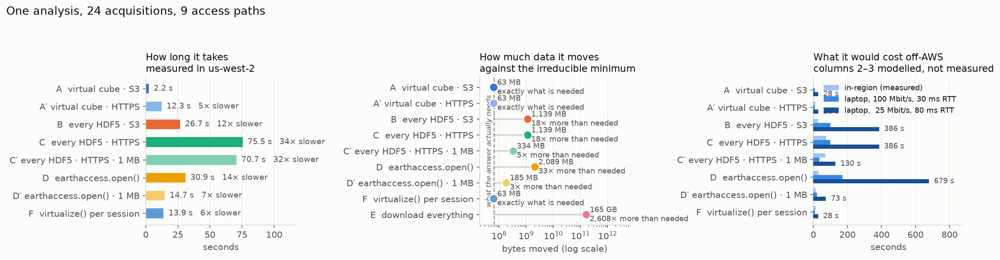

All eight paths return **the same 24 medians** — the check that makes the rest of the table mean
anything. Wall times for the granule-at-a-time paths moved by up to 1.8× across five runs (B ran in
19.7, 21.6, 36.2, 23.5 and 26.7 s) while byte and request counts did not move at all: trust the byte
columns and read the time ratios as ranges.

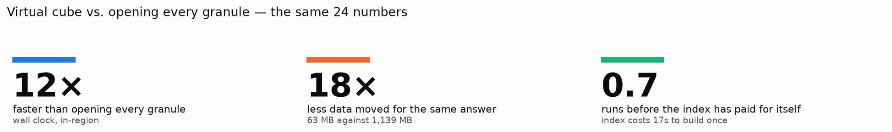

What the table says:

- **Against the realistic in-region baseline (B), the cube is 9–13× faster and moves 18× less** —
  and path A moves *exactly* the chunk bytes the answer needs, which is the floor. What disappears
  is not pixel reads — every path reads the same chunks — but the HDF5 B-tree traversal, re-paid per
  granule per session. The AOI's chunks are 2.64 MB per granule; a direct reader moves 11.8 MB
  (1 MB blocks), 43.3 MB (4 MB) or 167.6 MB (16 MB) before it can find them.
- **The idiomatic call, configured well, gets halfway (D′).** `earthaccess.open()` picks its fsspec
  block size from *file size* — 16 MB for anything over 1 GB, so for every NISAR granule — a
  heuristic tuned for ICESat-2-style files with hundreds of small datasets. earthaccess's own
  [fsspec how-to](https://earthaccess.readthedocs.io/en/stable/user/howto/fsspec/) says to align the
  block with the file's internal chunk; a NISAR chunk is ~1 MB. One keyword,
  `open_kwargs={"cache_type": "blockcache", "block_size": 1 << 20}`, halves the wall time and cuts
  the bytes 11×. It still moves 2.9× the bytes the answer needs and takes 6.6× as long as the cube,
  because the cost it cannot tune away — walking each file's metadata, per granule, per session — is
  exactly the cost the cube pays once.
- **`earthaccess.virtualize()` is path A without the repository (F).** Built per session with a
  scoped `HDFParser`, it costs 10.9 s to index plus 2.9 s to read — the same bytes and requests as
  A, because it *is* A's index, rebuilt and discarded. That 11 s is precisely what a shared index
  amortises.
- **A virtual cube is not an in-region-only technique.** Path A′ resolves `https://` references
  through `icechunk.http_store` with an Earthdata bearer token — no S3 anywhere — and returns pixels
  identical to A. The honest off-AWS pairing is A′ against C on the same endpoint: **12.3 s against
  75.5 s, moving 18× less data** (4.4–8.6× across runs). The protocol switch alone costs 2.5–4.3×
  for granule-at-a-time reads and 3.7–6.5× for the cube.
- **Over HTTPS the request count matters more than the block size (C′).** A 1 MB block cuts C's
  bytes 3.4× but saves only 6 % of its time: 288 requests at HTTPS latency dominate. The cube's
  advantage off-AWS is that it makes the *fewest requests* as well as moving the fewest bytes.
- **Two things invert advice given above.** Threads help over HTTPS (network-bound, not
  GIL-bound). And authentication is *easier* over HTTPS: the EDL bearer token is good for weeks,
  where S3 credentials expire hourly and need the refreshable-callable dance of failure #5.
- **Discovery is free, and the two search APIs disagree.** Both answer in well under a second; they
  do not return the same record — see failure #9.

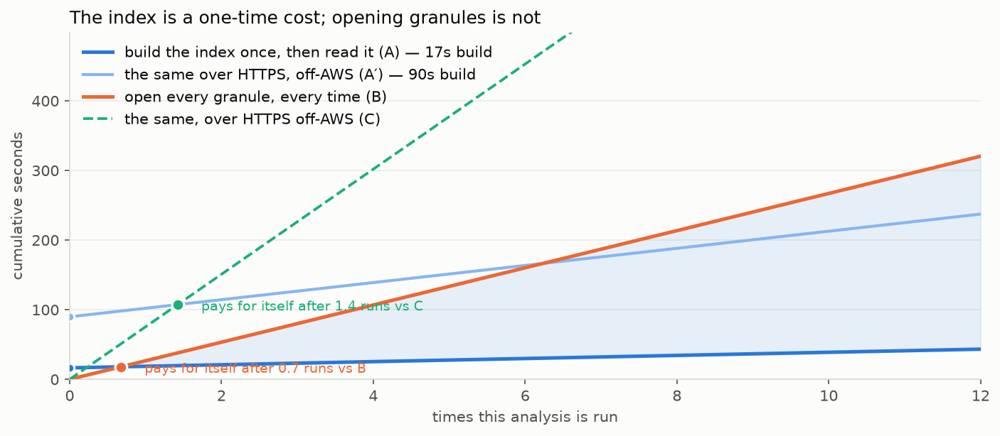

**The index pays for itself in about one run**, because building it is itself a metadata-only
operation (~0.7 s/granule, 17 s for the track-frame). Off-AWS, where the index has to be built
over HTTPS, it pays back in about 1.5 runs — and in zero if someone else built it. Anyone who runs
an analysis twice, or shares the cube once, is past break-even.

**Scale note.** The answer is 192 bytes; the granules holding it are 165 GB — 860 million times
more data than result. The comparison narrows for analyses that read most of every granule, where
metadata stops dominating: virtualization helps least when you need everything.

## Recommendations, by where you are

The ranking depends on two things: whether you are in `us-west-2`, and whether anyone will ask the
question twice. Notebook 4's last section has the full table.

**In AWS `us-west-2`** (CryoCloud, any Earthdata Cloud hub)

| You want | Use | Cost here |
|---|---|---|
| A time series anyone might ask for again | **A** — the shared cube: `nisar_cubes.find` → `open` | 2.2 s, 63 MB |
| A one-off stack, no repository | **F** — `earthaccess.virtualize(…, parser=HDFParser(group, drop_variables))` | 14 s, 63 MB |
| The HDF5 files themselves (metadata trees, masks) | **D′** — `earthaccess.open(…, open_kwargs={"cache_type": "blockcache", "block_size": 1 << 20})` | 15 s, 185 MB |
| Most of every granule | D′, or `earthaccess.download()` (~2 min for 165 GB at 10 Gbit/s) | — |
| *avoid* | default `earthaccess.open()`; `xr.open_datatree(…, engine="h5netcdf")` on a whole granule | 31 s, 2.1 GB |

**Outside AWS** (laptop, university cluster)

| You want | Use | Cost, in-region-equivalent |
|---|---|---|
| A time series, an HTTPS index is reachable | **A′** — the cube's `https/` tree (needs the ~1.7 GB repo mirrored publicly — open item) | 12 s, 63 MB, 96 requests |
| A time series, no index | **C′** — `fsspec` HTTPS with 1 MB blocks, or `earthaccess.virtualize(access="indirect")` once per session | 71 s, 334 MB, 288 requests |
| Whole scenes, or many dates × many sites | `earthaccess.download()` / Vertex / `asf_search`, then local `h5py` | 3.7 h per 24 granules at 100 Mbit/s |
| One band in QGIS / GDAL | GDAL `/vsicurl` on the `.h5` subdataset ([nisar-docs](https://nisar-docs.asf.alaska.edu/access-overview/)) | — |

Everywhere: set the fsspec block to the chunk (~1 MB); scope to `grids/frequencyA` (or `B`);
deduplicate product versions; if the same stack will be read twice, build the index once and keep it.

---

# Part III — Does the cube produce a usable signal? (notebook 3)

Fast is not the same as right. Notebook 3 checks the cube three ways rather than asserting it, over
six windows on Mount Rainier from the summit to lowland forest and two hand-drawn fields beside
the Paradise SNOTEL station.

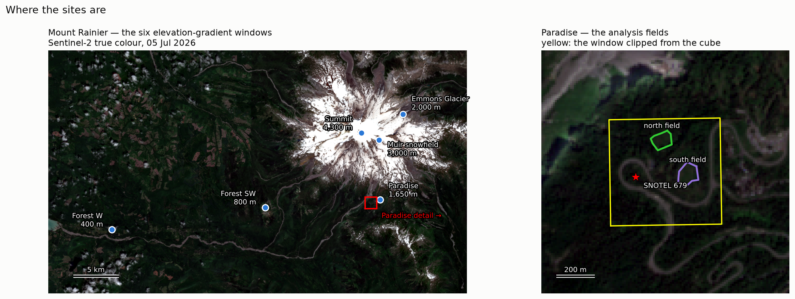

**The round trip closes.** Pixels read back out of the Icechunk store are byte-identical to the
same window read straight from the source `.h5` with `h5py`. Virtual references in, real pixels
out, nothing copied. (`pixi run nisar-validate` repeats this check on random windows of the
regional repository.)

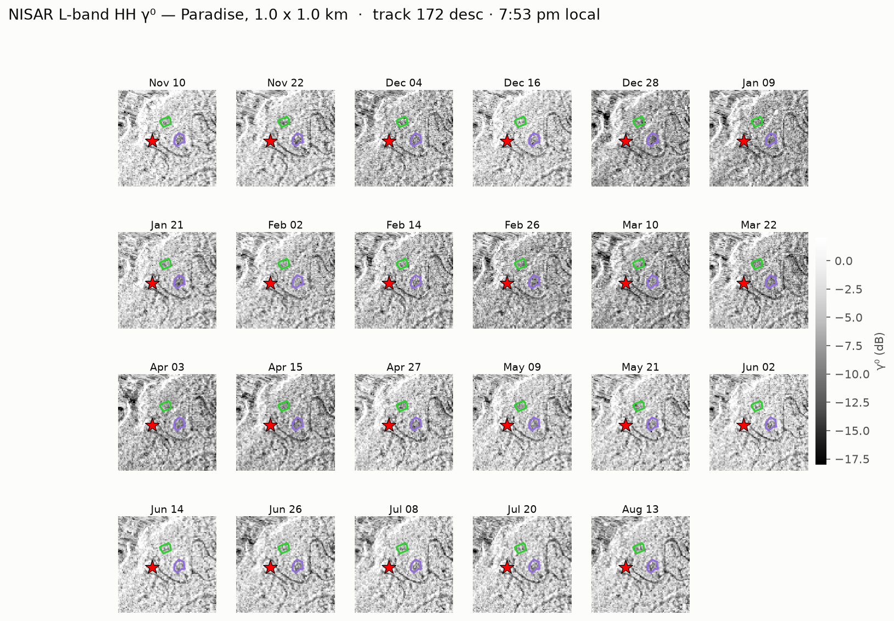

**Against ground truth.** Median γ⁰ over a field beside the Paradise SNOTEL station (679),
correlated with the station's own snow-water-equivalent record interpolated to each acquisition:

| Channel | n | r vs SWE | Range |
|---|---|---|---|
| NISAR HH (L-band, 24 cm) | 23 | **−0.68** | 3.4 dB |
| NISAR HV | 23 | −0.64 | 3.9 dB |
| Sentinel-1 VV (C-band, 5.5 cm) | 35 | **−0.83** | 6.6 dB |
| Sentinel-1 VH | 35 | −0.86 | 7.4 dB |

Peak SWE 0.98 m on 24 April; snow-free 15 June.

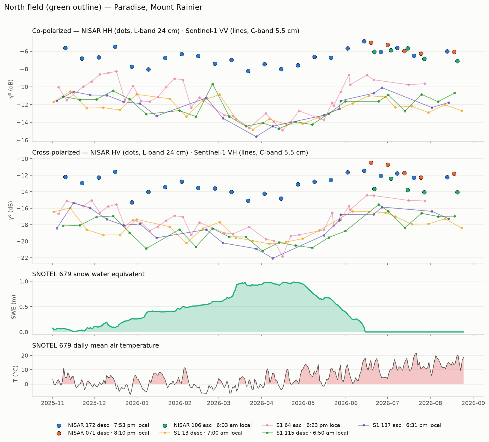

Every channel anti-correlates with the snow pillow — more water in the pack, less backscatter —
and the two radars differ by the amount wavelength predicts. Sentinel-1 at 5.5 cm tracks SWE
substantially more tightly than NISAR at 24 cm, over roughly twice the dynamic range, because
L-band penetrates further and keeps more ground return. Both minima land near peak SWE. Coincident
Sentinel-2 chips confirm snow on the ground on the dates the radars say there is. Two satellites
sharing nothing but a target, ordering themselves the way the physics says they should, is a far
better check than any single series looking seasonal.

**At mountain scale.** Six windows from summit to lowland forest, median HH, full range over ten
months:

| Site | Elevation | HH range |
|---|---|---|
| Summit | 4,300 m | 0.9 dB |
| Muir snowfield | 3,000 m | 3.4 dB |
| Emmons Glacier | 2,000 m | 4.3 dB |
| Paradise | 1,650 m | 4.4 dB |
| Forest SW | 800 m | 3.7 dB |
| Forest W | 400 m | 0.7 dB |

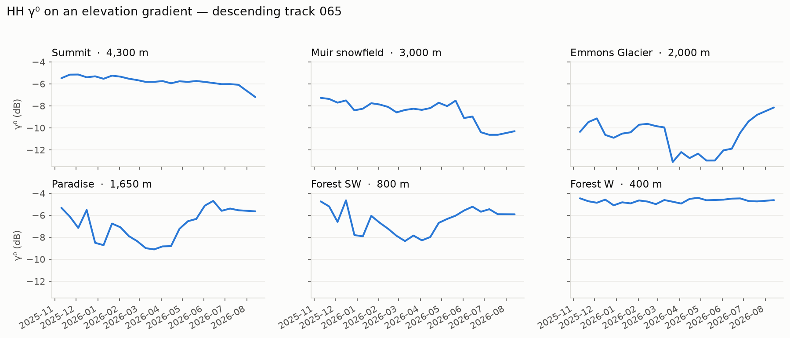

Flat at both ends, loud in the middle. The 400 m forest control is nearly invariant, which is what
L-band forest should do and is the permission slip for reading the rest; the summit is nearly as
flat because at 4,300 m there is no seasonal melt transition to see.

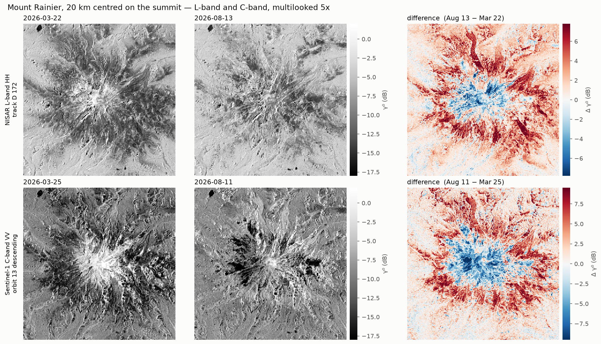

The same contrast at mountain scale: a 20 km window centred on the summit from NISAR (top) and
Sentinel-1 (bottom), near peak SWE in late March and snow-free in mid-August, with the difference
alongside. The pattern is the same shape at both wavelengths — the mid-elevation flanks brighten
once the snowpack is gone (red), the summit glaciers darken in August (blue) — but C-band swings
further, and its summer darkening reaches much further down the upper mountain than L-band's does.

**None of this is a melt-timing retrieval.** One descending NISAR track and one look geometry; a
single Sentinel-1 relative orbit chosen to hold geometry constant; hand-drawn fields; no DEM, so
no incidence-angle or layover treatment; and provisional NISAR products with no guaranteed
radiometric stability. Read the melt window alone and L-band is nearly flat. The continuous
comparison against SWE is the more honest instrument, and it exists only because the cube made a
23-date series cheap enough to compute in a second.

---

# Part IV — The western North America cube

## What was built

Every `NISAR_L2_GCOV_PROVISIONAL_V1` granule over `(-130, 30, -100, 62)` — British Columbia,
Alberta and southern Yukon to the Mexican border, Pacific to the Rockies' east flank — is indexed
in one Icechunk repository. The build took **35 minutes** on one 16-core CryoCloud node:

| | |
|---|---|
| Files / kept acquisitions | 3,428 / 3,384 (44 superseded product versions dropped) |
| Cube keys (track-frame × mode × pols) | **548** — all 548 are a single grid |
| Groups | **1,008** — 460 `freqA` + 548 `freqB` |
| Granule-bands indexed | **6,359**, 0 failures, 148 commits |
| Index | **1.73 GB** for 19.5 TB of imagery (both reference schemes) |
| CRS | UTM zones 8–14, plus EPSG:3413 on the northernmost frames |
| Validation | 1,008 groups consistent; 12/12 random windows byte-identical to `h5py` |

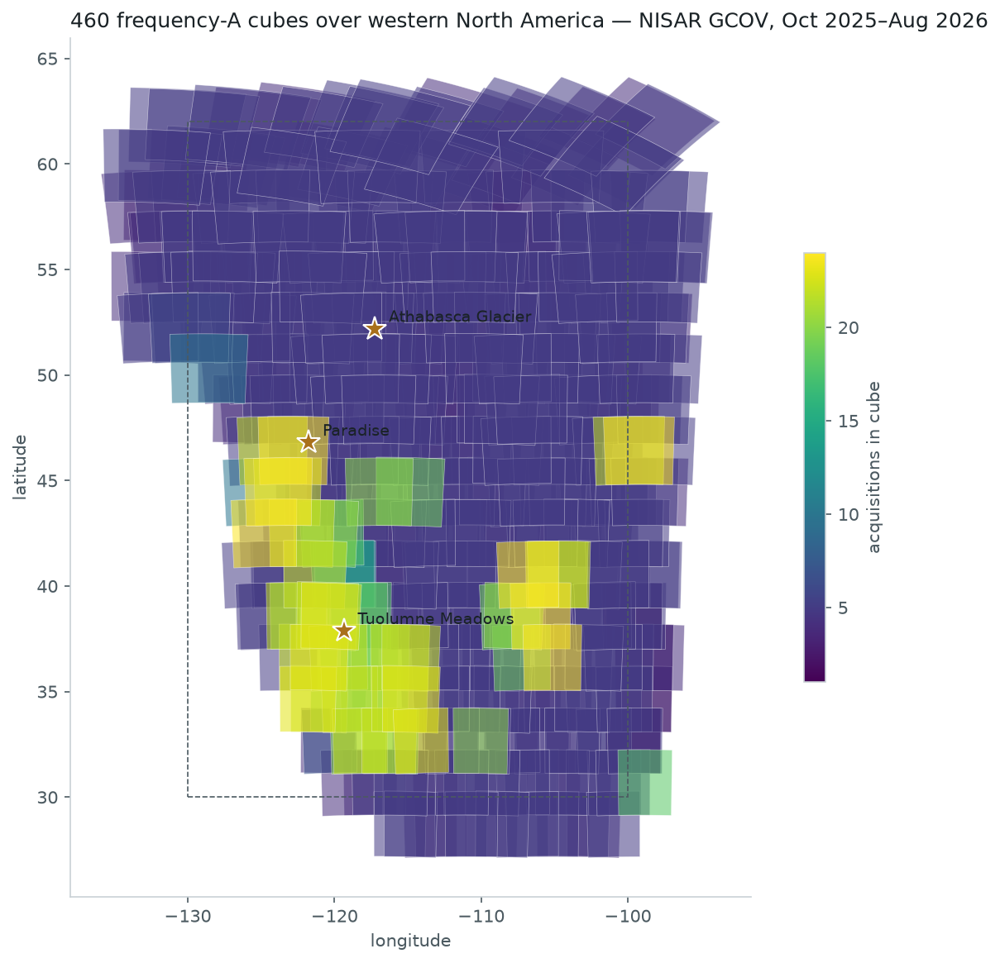

The archive is not uniform: 54 of the 460 `freqA` cubes have ten or more acquisitions; most
track-frames have four or five so far. They will all grow — `pixi run nisar-append` adds new
acquisitions without rebuilding.

## Layout

```
s3://nasa-cryo-persistent/egagli/nisar-gcov/wna/
├── s3/     {D172_F065}/{4005_DHDH}/{freqA|freqB}     cubes referencing s3:// granules (in-region)
├── https/  …the same tree…                           cubes referencing https:// granules (anywhere)
└── catalog/cubes.parquet, collection.json, items/    one row / STAC Item per cube
```

One group per **track-frame × mode × polarisation × band**; each is a `(time, y, x)` virtual cube.
`freqA` is the 10 m primary band (HH/HV, or VV/VH), `freqB` the 80 m secondary band that every
granule also carries — and the *only* band in the 5 MHz `0005`/`NADV` acquisitions. The two trees
are written in the same commit; Icechunk cannot serve an `s3://` prefix through an HTTP store, so
the HTTPS tree is derived from the S3 manifests with `rename_paths`, not re-read.

## Using it

```python
import sys; sys.path.insert(0, "contributors/eric")     # or run from that directory
import nisar_cubes as nc

cat  = nc.load_catalog()                                 # GeoDataFrame, 1,008 cubes, 0.1 s
hits = nc.find(bbox=(-121.9, 46.7, -121.6, 46.95))       # cubes whose *imaged* footprint sees Rainier
ds   = nc.open(hits.iloc[0])                             # lazy xarray.Dataset: HHHH, HVHV (time, y, x)
chip = nc.clip(ds.HHHH, my_polygon)                      # index-subset then clip; reads only those chunks
frac = nc.coverage(hits.iloc[0], my_polygon)             # valid-pixel fraction at the AOI, newest scene
```

The repository is ordinary Icechunk and every cube an ordinary Zarr v3 group, so plain `xarray`
works too — `nc.open_repo()` only wires up the credentials for the chunk references:

```python
store = nc.open_repo().readonly_session("main").store
ds    = xr.open_zarr(store, group="s3/D172_F065/4005_DHDH/freqA", consolidated=False, zarr_format=3, chunks={})
tree  = xr.open_datatree(store, engine="zarr", group="s3/D172_F065", consolidated=False, zarr_format=3, chunks={})
```

(`group="s3"` opens the whole region as one DataTree — ~2,000 nodes, about five minutes; the catalog
is the fast way to navigate, the tree the complete one.)

`nc.open(..., scheme="auto")` uses the `s3/` tree in `us-west-2` and the `https/` tree elsewhere.
Both need Earthdata Login in `~/.netrc`. **The index itself lives in a CryoCloud bucket that is not
public**, so today the `https/` tree only helps a CryoCloud user who wants to test the off-AWS path;
serving laptop users needs the repository mirrored to a public bucket (a copy, not a rebuild).

## Every track that sees a point

A cube is one look geometry. Most places in the region are imaged by two to five track-frames —
ascending and descending, adjacent relative orbits, sometimes the 5 MHz `frequencyB`-only mode —
each on its own grid, so they cannot be one array. What *can* be one array is anything derived at a
site. Notebook 5 asks `nc.find(point, band=None)`, clips a 500 m window from each of the eight cubes
that image Paradise, and stacks the per-date medians along a `cube` dimension with the orbit
metadata as coordinates:

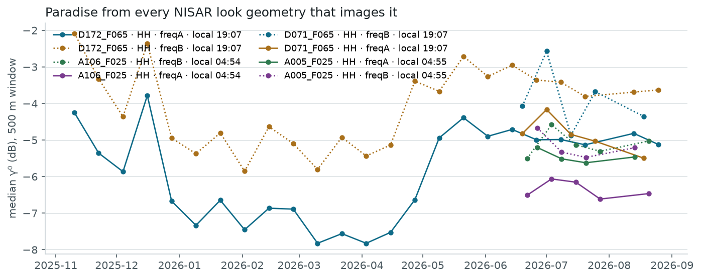

Dawn (ascending, ~05:00 local) and dusk (descending, ~19:00) series are different observations of a
spring snowpack — refrozen versus wet — so they are plotted, not averaged (failure #7). If you do
want the *imagery* from several tracks on one grid, that is a reprojection — a copy, not a view —
and cheap for a chip:

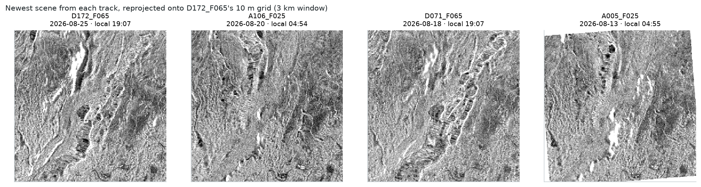

The same recipe works anywhere in the region with no index-building by the user — three sites,
three function calls each:

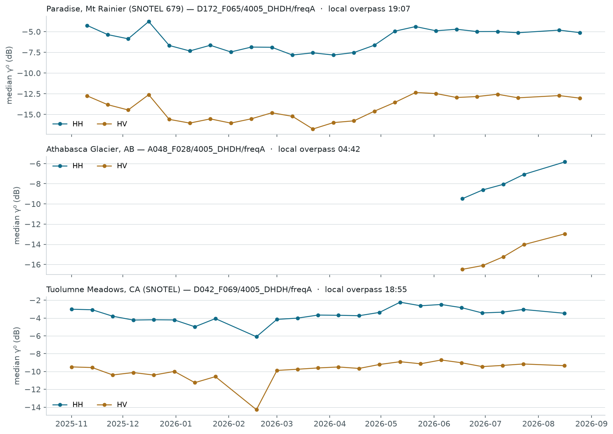

## What metadata a cube carries — and what it does not

Virtualisation copies no pixels, and it copies very little metadata either: only the `grids/`
group is walked, so NISAR's `identification/`, `metadata/calibrationInformation/` and
`metadata/sourceData/` trees are **not** in the cube (the first cannot be virtualised at all —
its `complex64` attributes are not JSON; failure #1). What a cube does carry, by layer:

| Where | What | Origin |
|---|---|---|
| **Coordinates** | `time` (acquisition start); per-time `granule` (product name), `coverage` (`F`ull / `P`artial frame), `ctr` (product counter); `x`/`y` | filenames; the first granule's HDF5 dimension scales |
| **`projection` variable** | CF `grid_mapping` attributes: `epsg_code`, `spatial_ref` WKT, `utm_zone_number`, `grid_mapping_name`, ellipsoid parameters | copied from the granule, unchanged |
| **Raster attrs** | `description`, `long_name`, `units`, `valid_min`, `grid_mapping`, `_FillValue` | copied; the per-granule statistics (`mean_value`, `max_value`, `min_value`, `sample_stddev`) are **dropped** — `compat="override"` would have stamped the first granule's onto the whole stack |
| **Group attrs** | `grid_signature`, `epsg`, `posting_m`, `bounds`, `band`, `channels`, `track_frame`, `relative_orbit`, `frame`, `direction`, `mode`, `pols`, `collection`, `crids`, `granules` (the ledger), `times`, `time_sorted`, `last_indexed`, `source_urls` | derived by `nisar_cubes.build` |
| **Chunk references** | per chunk: source URL, offset, length, plus a `last_updated_at` checksum | VirtualiZarr manifest → Icechunk |
| **Catalog** (STAC / GeoParquet) | grid footprint in lon/lat, **imaged** footprint (union of CMR polygons), `local_overpass_time`, `n_times`, `sat:`/`sar:`/`proj:` fields, `icechunk:group`/`snapshot` | `nisar_cubes.catalog`, from group attrs + CMR |

## Relation to `earthaccess.virtualize()`

earthaccess 0.18 ships its own VirtualiZarr entry point, and it converged on the same design: an
`obstore` registry with `NasaEarthdataCredentialProvider` for `access="direct"` and an `HTTPStore`
with an EDL bearer header for `access="indirect"` — the `s3/` and `https/` duality above. Its default
parser is DMR++, which NISAR does not ship, so on these granules it falls back to `HDFParser` with a
warning and, called at the file root, returns an *empty* dataset. Given a scoped parser it works and
is the right tool for a one-off stack that does not need the shared repository (path F above):

```python
from virtualizarr.parsers import HDFParser
vds = earthaccess.virtualize(
    granules, access="direct", concat_dim="time", preprocess=lambda ds: ds.expand_dims("time"),
    parser=HDFParser(group=nc.config.HDF_GROUPS["freqA"], drop_variables=list(nc.config.DENY_VARIABLES)),
    coords="minimal", compat="override",
)   # 24 Rainier granules in ~12 s; access="indirect" gives https:// references
```

What it does not do is the part `nisar_cubes` exists for: deduplicate product versions, group by
output grid, persist to Icechunk, resume, or handle `frequencyB`.

## Operating it

```bash
pixi run nisar-inventory        # CMR → inventory.parquet; diff against asf_search
pixi run nisar-build            # index what is not yet indexed; resumable; idempotent
pixi run nisar-append           # inventory + build + catalog — run after each 12-day cycle
pixi run nisar-validate         # per-group checks + random byte-identity round trips vs h5py
pixi run nisar-drift            # HEAD every referenced granule; report changed/missing
pixi run nisar-compact          # expire snapshots (keep last 10 + one tag per month), collect garbage
pixi run nisar-backfill-coords  # one-off: add per-time coordinates to groups built before they existed
```

Design notes, each answering a failure below: duplicate product versions are resolved by product
counter in the inventory (#3); cube membership is decided by the coordinate arrays, and a new grid
in an existing track-frame opens a *sibling* group and logs a warning instead of being skipped or
merged (#2, #6); `find(require_data=True)` intersects the *imaged* footprint, not just the grid
rectangle (#8); CMR and ASF are both queried and their disagreement is printed, not merged (#9);
every virtual reference carries a `last_updated_at` checksum so a republished granule fails loudly;
the granule ledger lives in group attributes so a killed build resumes where it stopped; a fixed
variable deny-list keeps `inputDataExceptionMask` and `listOfPolarizations` from colliding on
dimensions in `frequencyB` and quad-pol files; `ManifestBuilder` holds one process pool for the
whole run, because 440 of the 548 cube keys have only four or five granules and could not amortise a
pool each. Reads over `s3://` refresh their hourly credentials via
`icechunk.s3_refreshable_credentials`; the build refreshes its own through
`obstore.auth.earthdata.NasaEarthdataCredentialProvider`.

---

## Where it breaks

Per `AGENTS.md`, failures are results. Nine, all reproduced in the notebooks, plus three traps.

**1. You cannot virtualize a whole NISAR granule.** `HDFParser()` at the file root raises
`TypeError: Object of type complex is not JSON serializable` — 40 `complex64` attributes under
`metadata/calibrationInformation/crosstalk/`, and Zarr v3 metadata is JSON. Scoping to
`grids/frequencyA` avoids them, which means a virtual cube carries rasters and coordinates but
**not** NISAR's metadata tree. `metadata/sourceData` can be virtualized as a separate group;
`identification` cannot — no dimension scales, so its variables collide on `phony_dim_0`.
(`earthaccess.virtualize()` at the root hits the same wall and returns an empty dataset, silently.)

**2. One *frame* is not one grid — because a frame spans relative orbits.** Concatenating all 28
descending frame-065 granules fails with `AlignmentError`: 23 on 35712 × 36144 at origin
(334805, 5320075) and 5 on 35352 × 35784 at (496805, 5320795), ~250 km apart. They are the same
frame on two *different relative orbits* (172 and 071), which the first version of the code could
not tell apart because it had mislabelled the filename fields. Keyed on the true track-frame, all
548 keys in western North America are one grid each. The lesson survives the correction: **group on
the actual coordinate arrays** (`grid_signature`), and let the filename be a smell test.

**3. The archive holds duplicate product versions.** One acquisition appears as both `..._001.h5`
and `..._002.h5` — 44 times across western North America. Indexing both puts the same date into
the cube twice under one timestamp, silently. The inventory keeps the highest product counter. The
most dangerous of the nine, because it produces a wrong answer instead of an error — and it recurred
in notebook 4, where it would have made the benchmark unfair by giving one path an extra file.

**4. RSLC does not attach dimension scales.** The parser falls back to `phony_dim_N` and then
collides between the 2-element `listOfPolarizations` and the 54,720-row image. Forcible by
dropping every non-raster variable, but the result has no geolocation at all. (An earlier guess
that RSLC would be blocked by a CFloat16 dtype was wrong — it stores `complex64`, which virtualizes
fine.) The same collision appears in GCOV's `frequencyB` and in quad-pol files, where
`inputDataExceptionMask` and `listOfPolarizations` disagree with the rasters on dimension length —
hence the fixed deny-list.

**5. Credentials expire hourly, and appends leak space.** EDL S3 tokens last an hour; a static
token dies partway through a large cube. Icechunk needs
`icechunk.Credentials.S3(icechunk.s3_refreshable_credentials(callable))` with a **module-level**
(picklable) callable — hence `nisar_virtual.py` rather than a notebook cell. Separately, every
append writes a new immutable manifest and keeps the old one: the repo grew 4.6 → 36.2 MB over 11
appends. `nisar-compact` applies a retention rule (last 10 snapshots plus one tag per month) rather
than expiring everything.

**6. Reusing pixel indices across grids fails silently, and looks like science.** A first pass at
the time series sampled the same `(y, x)` windows across all 28 granules and produced a clean 6 dB
"seasonal" drop at every site — including the forest control. The five granules on the second grid
put those indices ~250 km away. Nothing errored; the numbers were plausible; only the control site
being *wrong in the same way* gave it away. Group by grid, and keep an invariant site in every
analysis.

**7. Orbit direction does not mean the same thing to two missions.** NISAR ascending is ~5–6 am
local and descending ~7–8 pm; Sentinel-1 is the reverse — ascending ~6:25 pm, descending ~6:55 am.
(Those are circular means of local time-of-day across each series, not single overpasses.)
Pairing "ascending with ascending" pairs a dawn overpass with a dusk one, which for a spring
snowpack is the difference between refrozen and wet, i.e. most of the signal. Pair on **local
time**, not the direction flag, and label every series with its relative orbit — the catalog carries
`local_overpass_time` for exactly this reason.

**8. A grid can contain your AOI and still hold no data there.** An ascending grid covers Paradise,
but the pixels are fill — the grid is a rectangle, the imaged swath inside it is not. Checking
bounds is not checking coverage; `find()` intersects the imaged footprint and `coverage()` reads the
pixels.

**9. `earthaccess` and `asf_search` do not index the same archive.** Over Rainier, CMR returns
**23** distinct acquisitions and ASF **24**; over all of western North America ASF knows **15**
provisional acquisitions CMR does not. ASF also exposes multiple *reprocessing campaigns* of the
same take (CRIDs `P05023` and `X05009`) where CMR shows one. Neither is wrong; they are different
indexes. But a pipeline that assumes they agree quietly indexes a different record depending on
which library it imported. This also sharpens #3: there are **two** duplication axes — the CRID and
the trailing product counter within a campaign. `asf_search` hands you `crid` as metadata; with
`earthaccess` you parse the filename yourself. And `max(crid)` is a convention, not a documented
ordering — worth confirming with ASF.

**Three traps.** Transient S3 failures (`InternalError`, dropped connections) are normal at this
request volume and will kill an unattended run without retries — everything here wraps its reads.
When instrumenting fsspec, patch `file.cache.fetcher`, not `file._fetch_range`: the cache captures
the bound method at construction, so the obvious patch silently reports **zero bytes**. And
`xarray.to_zarr(mode="a")` **replaces** an existing group's attributes with the Dataset's: adding
the per-time coordinates wiped the granule ledger on all 2,016 groups. Icechunk's history made the
repair exact (`ops.restore_group_attrs`), the backfill now passes attributes through, and
`nisar-validate` fails on a group whose ledger is missing.

---

## Prior art: Earthmover's GOES-16 store

[Cloud-Optimizing GOES-16 with Virtual Zarr](https://www.earthmover.io/blog/virtual-zarr) is the
same technique at a scale that makes ours look like a unit test: 380,000 netCDF4 files, ~115 TB,
**7.1 billion chunk references**. Four things worth carrying over.

**The economic argument is stronger than the speed argument.** ~$100 to generate the manifests and
**$1.84/month to store ~80 GB of metadata, against $2,600/month** for a duplicated archive. The
point is not that virtualizing is fast; it is that the alternative — a converted copy of the NISAR
archive — is a recurring cost nobody wants to carry, and it goes stale every time ASF publishes.

**"Archives must be homogeneous" is a general law, not our bad luck.** GOES-16 had to be split into
several Zarr groups because the encoding changed partway through the record. We hit the same class
of problem from a different direction (failure #2) and the resolution is the same: detect the
discontinuity, split into separate stores, do not paper over it.

**Virtual works better for cube-like data than swath data.** Geocoded products stack because they
already live on a shared map grid, and no manifest cleverness will make a swath product do that.

**They still recommend native Zarr where feasible.** Virtual Zarr is the pragmatic answer when the
data must stay in its original format and copying it is prohibitive — exactly NISAR's situation —
not a claim that it beats a purpose-built store.

One operational note that applies directly: Icechunk warns when a referenced archival file has
been modified. Our references point at specific `.h5` objects, so if ASF replaces or withdraws a
granule in place, the index breaks — `last_updated_at` checksums and `nisar-drift` are the answer.

---

## What is left, and what would tell us this is the wrong approach

The study's original list of next steps — put the index in S3, partition and catalog, scale the
build, scheduled append, retention, drift guard, assertions, retries, off-AWS references — is
implemented in `nisar_cubes/` (see the plan's status table). Serverless fan-out turned out to be
unnecessary at this scale: 548 cube keys took 35 minutes on one node. What remains:

- **A public mirror of the index.** The `https/` tree works, but the repository sits in a bucket
  only CryoCloud can read. Copying ~1.7 GB to a public bucket serves every off-AWS user; nothing has
  to be rebuilt.
- **The 15 acquisitions only ASF knows about.** The inventory reports them; ingesting them needs an
  `asf_search`-fed path.
- **The BETA collection** (2,234 granules, other CRIDs) as a separate tree — never on the same time
  axis as PROVISIONAL. **Alaska** (`--region alaska`, 3,414 more granules) is a second run of the
  same code. **GSLC**, for velocity.
- **Upstream:** `validate_and_normalize_path_to_uri` is 26% of build time and runs once per chunk
  reference; validating once per granule is a small PR to VirtualiZarr.
- **The arithmetic, for a bigger ingest.** Measured: ~0.45 s per granule with 8 processes and
  ~250 KB of index per granule-band. Per million granules that is roughly **5 core-days and
  ~250 GB of index** — a few dollars a month on S3, against ~7 PB and six figures a month to
  duplicate the pixels. That ratio, not the 9× speedup, is the argument.

Worth stating so it stays falsifiable:

- **If the analyses people actually run read most of every granule**, the metadata cost stops
  dominating and the advantage narrows toward nothing. Our 9–13× came from a 1 km AOI.
- **If grids change often enough that cubes fragment faster than they accumulate**, the catalog
  becomes the hard problem and the cubes too short to be worth indexing. So far: 548 of 548 keys
  are one grid.
- **If ASF ships analysis-ready NISAR cubes**, or DMR++ sidecars, or cloud-optimized HDF5, this is
  obsolete or trivial, and that is fine. Earthmover say it themselves: native Zarr where feasible,
  virtual Zarr when the data must stay where it is.

---

## Running it

```bash
pixi install
pixi run jupyter lab
```

Requires Earthdata Login credentials in `~/.netrc` — NISAR provisional products are not
anonymously accessible; an unauthenticated GET bounces to the URS OAuth endpoint with a 401. **No
credentials or tokens appear in this folder**; they are fetched at runtime. Reads are direct-S3 by
default, so this is meant to run in `us-west-2`.

Things to know:

- `jupyterlab` and `nbconvert` are declared in `pixi.toml`, so `pixi run jupyter lab` works and
  the environment is self-contained.
- Notebooks 3–5 save their figures to `figures/`; re-executing them regenerates the images above.
- Notebook 3 reads geometries from the sibling `nisar` repo
  (`/home/jovyan/repos/nisar/geometries/*.geojson`) and pulls Sentinel-1 and SNOTEL through
  `easysnowdata`, Sentinel-2 through the Element84 STAC API. Those are network calls to non-NASA
  services; the NISAR half of the notebook runs without them. It mirrors
  [`nisar/notebooks/mt_rainier_GCOV_backscatter_time_series.ipynb`](../../../nisar/notebooks/mt_rainier_GCOV_backscatter_time_series.ipynb)
  — same study area, same geometries, same field medians — so the two access paths can be compared.
- Notebook 4 keeps the notebook-3 cube current with `nv.append_new` before measuring, so every path
  sees the same granules; the archive gains an acquisition every 12 days.
- `nisar_cubes` and `nisar_virtual.build_manifests(workers=N)` use a process pool, and Python 3.14
  defaults to the `forkserver` start method, which re-imports `__main__`. In a script, put the call
  behind `if __name__ == "__main__":`. In a notebook it just works.
- `pixi run` processes linger as zombies after they exit; `kill -0` on their pid still succeeds. Check
  the log, not the pid.
